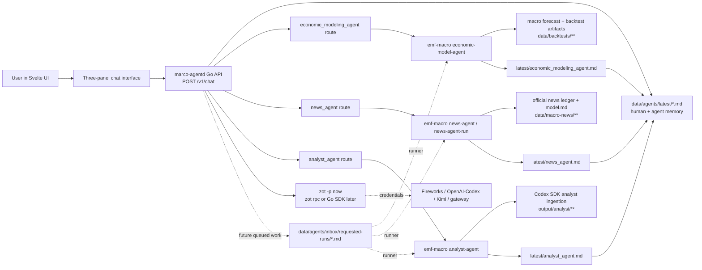

# Marco Agent Chat And Interface Strategy

Date: 2026-05-31

Status: v0 implementation plan with a Go/Zot runtime boundary started.

## Where We Are

Marco now has three Python CLI-backed specialist packet emitters and the start
of a fourth Go/Zot chatbot surface:

| Agent | Current status | Main context | Runtime shape |
| --- | --- | --- | --- |
| `economic_modeling_agent` | Reads macro forecast artifacts and emits structured packets/handoffs | `data/backtests/macro-forecast-lab/`, `data/agents/latest/economic_modeling_agent.md` | Go `marco-agentd` calls `emf-macro economic-model-agent --no-handoff` |
| `news_agent` | Fetches official macro feeds, journals marginal changes, updates a bounded `model.md` | `data/macro-news/`, `data/agents/latest/news_agent.md` | Go `marco-agentd` calls read-only `emf-macro news-agent` |
| `analyst_agent` | Wraps the Codex SDK analyst ingestion output and can invoke the analyst CLI when requested | `output/analyst/`, `data/agents/latest/analyst_agent.md` | Go `marco-agentd` calls `emf-macro analyst-agent` |
| `ui_chatbot_agent` | Go/Zot synthesis surface; no Svelte chat UI yet | latest specialist handoffs plus selected CLI packet reads | `POST /v1/chat` on `marco-agentd` |

The agent runtime should not live in Python. Python remains the data and
modeling CLI surface. The Go runtime owns HTTP endpoints, request routing,
prompt assembly, Zot invocation, and later queued run scheduling. Zot can be
driven either as the installed `zot` binary or, after the boundary is stable,
through its Go SDK.

## System Diagram



## Prompt Contract

`marco-agentd` exposes specialist prompt endpoints and shells out to Zot for
the model turn:

```http
POST /v1/agents/news-agent/prompt
Content-Type: application/json

{
  "prompt": "What recent central-bank news should the analyst read?"
}
```

The response shape is:

```json
{
  "schema_version": "marco.agent_prompt_response.v1",
  "agent_id": "news_agent",
  "prompt": "...",
  "answer_markdown": "...",
  "context_packet": {},
  "context_refs": []
}
```

The chatbot endpoint uses all available specialist packets and latest handoffs:

```http
POST /v1/chat
Content-Type: application/json

{
  "prompt": "What should I tell an economist about the current state?"
}
```

V0 calls `zot -p` with tools disabled and a strict Marco system prompt. The
provider defaults are configurable:

```sh
MARCO_AGENT_PROVIDER=fireworks
MARCO_AGENT_MODEL=accounts/fireworks/models/deepseek-v4-flash
MARCO_AGENT_REASONING=medium
MARCO_ZOT_BIN=zot
MARCO_PYTHON_CLI=.venv/bin/emf-macro
ZOT_HOME=/var/lib/marco/zot
```

For Codex-auth runs, set Zot's provider/model to the installed
OpenAI-Codex-compatible configuration instead of changing the Python CLIs.
On Node A, `tools/configure_node_a_zot_gateway.sh node-a` configures this Zot
home and verifies a live Fireworks DeepSeek v4-flash response.

## Runtime Strategy

The stable data plane is still markdown plus structured artifacts:

- raw and normalized data stay in `data/**`;
- metrics, predictions, summaries, and source manifests stay in JSON/CSV/JSONL;
- every specialist writes an immutable run folder under
  `data/agents/runs/<agent_id>/<run_id>/`;
- each specialist atomically updates one latest markdown file under
  `data/agents/latest/`;
- the Go runtime reads latest markdown and Python CLI packets;
- Zot handles prompt synthesis only after the Go runtime assembles bounded
  context.

This keeps the public chat UI explainable. A user can inspect the same files
the chatbot used, and a teammate can reproduce the packet with CLI commands.

## Svelte Interface Strategy

The next UI should be a three-panel workbench, not a landing page:

| Panel | Purpose | Core interactions |
| --- | --- | --- |
| Left: threads and runs | Conversation list, active context, agent run status | New thread, select thread, filter by agent, see queued/running/succeeded runs |
| Center: conversation | User prompts and chatbot answers | Ask question, see cited handoff files, trigger specialist prompt/run request |
| Right: artifacts and reports | Rendered markdown reports, metrics, news/model artifacts | Tabs for modeling/news/analyst, source links, copy API curl, open raw JSON/CSV |

Implementation notes:

- Use Svelte stores for `threads`, `activeThread`, `agentStatuses`,
  `selectedArtifact`, and `chatContext`.
- Render markdown reports in the right panel from API text/JSON fields, then
  harden with a markdown renderer once the data contract is stable.
- Keep the layout dense and operational: fixed left rail, fluid center stream,
  fixed or resizable right artifact inspector.
- On mobile, collapse to tabs: `Threads`, `Chat`, `Artifacts`.
- Every chatbot answer should show "Context used" with exact handoff paths and
  specialist agent IDs.
- A custom specialist call should be explicit in the UI: "Ask News Agent",
  "Ask Modeling Agent", "Ask Analyst Agent", and later "Queue Run".

## Engineering Sequence

1. Keep Python as data/modeling CLI only.
2. Keep the Go `marco-agentd` boundary as the prompt/chat HTTP runtime.
3. Add a request-file writer for `data/agents/inbox/requested-runs/*.md`.
4. Add a local runner that consumes queued requests and invokes exactly one
   specialist lane at a time.
5. Decide whether to keep spawning `zot -p`, move to `zot rpc`, or import the
   Zot Go SDK in-process. Use `zot rpc` if process isolation matters; use the
   SDK if low latency matters.
6. Build the Svelte three-panel UI against local API responses.
7. Add persisted chat threads once the API contract is stable.
8. Deploy dynamic API behind Node A auth/Caddy; keep the current Node A static
   preview until the service definition is durable.

## Non-Goals For This Pass

- No hosted uploads in the chat UI yet.
- No arbitrary shell execution from chat.
- No specialist endpoint should rewrite another agent's output.
- No investment recommendation language without cited model/news artifacts and
  explicit caveats.
